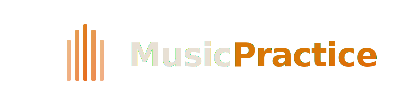

<div align="center">
  
  <br>
  <br>
  <p>
    
    
    
  </p>
</div>

<br>

# MusicPractice

A web app that turns YouTube videos into practice tools for musicians.

## Features

**Done:**
- YouTube import — paste a link, it downloads and processes
- Stem separation — vocals, drums, bass, guitar, piano, other (Demucs)
- BPM and key detection (librosa)
- Per-stem mute, solo, volume faders + master volume
- Real-time frequency visualizer
- Auto-thumbnail from YouTube

**Planned:**
- Chord detection
- Leaderboard ranking

## How it works

The audio goes through a pipeline: yt-dlp downloads it, ffmpeg normalizes to -14 LUFS, Demucs splits into 6 stems, librosa extracts BPM and key. Everything runs in a background queue so you can keep adding songs while it works.

The player uses the Web Audio API for synced multi-stem playback. Each stem has its own channel strip — mute, solo, volume, and a mini waveform visualizer.

## Stack

Django handles the backend. Frontend is Alpine.js with vanilla CSS — no build step, no bundler. Audio processing uses Demucs, librosa, yt-dlp, and ffmpeg.

## Quick start

```
pip install -r requirements.txt
python manage.py migrate
python manage.py runserver
```

Open `http://127.0.0.1:8000/`, register, paste a YouTube URL.
